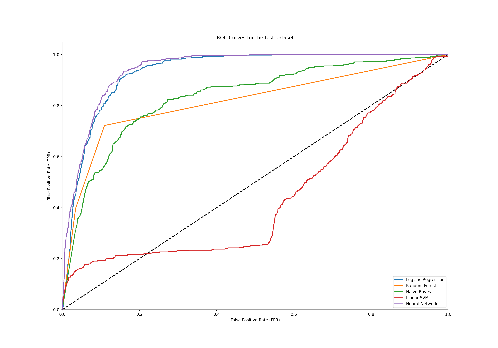

# Predicting BTD Purchases from Marketing Campaign Data

## Project Goal

Can we create a data processing pipeline and machine learning classifier that will predict whether a bank client will purchase a subscription to a bank term deposit (BTD)?

## Data source

This project makes use of the [UCI bank marketing data set](https://archive.ics.uci.edu/ml/datasets/Bank+Marketing#) to train and evaluate the classifiers defined in this repository.

## Running the experiments

### Installation

1. Setup [Docker for desktop](https://www.docker.com/products/docker-desktop)
2. Pull the docker image for this repo: `docker pull pauldhein/telemarket-model:latest`

### Dataset preprocessing

This experiment processes a CSV dataset into train/dev/test folds after first converting the label column to binary and all string-valued columns to categorical data. Categorical data columns are also one-hot encoded to aid in training. The script can be run with the following command:

```shell
docker run -it pauldhein/telemarket-model:latest python dataset_processor.py -p ../data/bank-full.csv
```

The `-p` flag specifies the full path of the CSV file to be processed.

### Model training

This experiment performs a grid search over specified hyperparameter sets for five different classification models. Extra processing is done during the experiment to:

1. Account for class imbalance in the labels
2. Select the top 20 features to improve classification using a mutual information statistic
3. Standardize the feature values using min-max standardization

The experiment can be run using the following command:

```shell
docker run -it pauldhein/telemarket-model:latest python model_trainer.py -p ../data/bank-full
```

The `-p` flag provides the prefix-path of the dataset to be used for training and evaulation.

### Model evaluation

This experiment verifies the performance of the various saved classifier configurations on either development data or test data. The experiment can be run using the following command:

```shell
docker run -it pauldhein/telemarket-model:latest python model_evaluator.py -t -d
```

The `-t` and `-d` flags specify to evaulate on the test set and the development set respectively.

## Experimental Results

### Evaluation metrics for the test set

| Model Name | Accuracy | Precision | Recall | F1 | AUC-ROC |
| ---: | :---: | :---: | :---: | :---: | :---: |
| Logistic Regression | 0.8623 | 0.4324 | 0.8677 | 0.5772 | 0.8647 |
| Random Forest       | **0.9053** | **0.5870** | 0.4238 | 0.4922 | 0.6938 |
| Naive Bayes         | 0.8371 | 0.3616 | 0.6592 | 0.4670 | 0.7589 |
| Linear SVM          | 0.2765 | 0.0501 | 0.3161 | 0.0865 | 0.2939 |
| Neural Network      | 0.8555 | 0.4242 | **0.9350** | **0.5836** | **0.8904** |

### ROC curve for the test set


